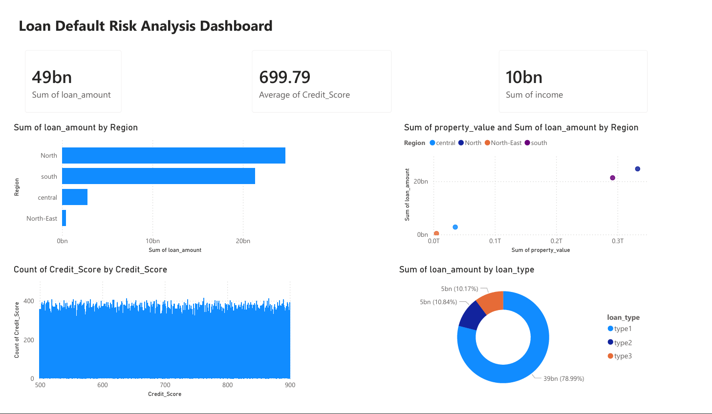

# Loan Default Risk Analysis

A data analysis project that explores borrower characteristics, loan distribution, and potential risk indicators in a loan portfolio.
This project demonstrates skills in **data cleaning, SQL analysis, and interactive dashboard creation**.

---

## Project Overview

Financial institutions need to understand borrower profiles and loan characteristics to manage credit risk effectively.
This project analyzes a loan dataset to uncover patterns related to:

* Loan distribution
* Borrower income
* Credit scores
* Property value vs loan amount
* Regional loan patterns

The goal is to provide **insights that could support credit risk assessment in a multifinance environment**.

---

## Dataset

The dataset contains loan application information including:

- Loan amount
- Credit score
- Borrower income
- Property value
- Loan type
- Region

The dataset is used to analyze borrower characteristics and potential credit risk indicators.

---

## Tools & Technologies

* Python (Pandas, Matplotlib)
* Jupyter Notebook
* SQL (SQLite)
* Power BI
* Git & GitHub

---

## Project Structure

LOAN-DEFAULT-RISK-ANALYSIS
│
├── dashboard
│   ├── loan_dashboard_data.csv
│   ├── loan_dashboard.pbix
│   └── loan_dashboard.png
│
├── data
│   └── loan_data.csv
│
├── database
│   └── loan.db
│
├── notebooks
│   └── loan_analysis.ipynb
│
├── sql
│   └── loan_analysis.sql
│
│
└── README.md


---

## Data Analysis Process

### 1. Data Cleaning (Python)

* Handling missing values
* Checking data types
* Removing inconsistencies
* Basic exploratory data analysis (EDA)

Key libraries used:

```
pandas
matplotlib
seaborn
```

---

### 2. SQL Analysis

Loan data was stored in an SQLite database and analyzed using SQL queries.

Examples of analysis:

* Total loan amount by region
* Average borrower income
* Loan distribution by loan type
* Credit score analysis
* Property value vs loan amount

---

### 3. Dashboard Visualization

An interactive dashboard was created to visualize key insights.

Main dashboard components:

* Total Loan Portfolio (KPI)
* Average Credit Score (KPI)
* Average Borrower Income (KPI)
* Loan Distribution by Region
* Credit Score Distribution
* Property Value vs Loan Amount
* Loan Type Distribution

---

## Dashboard Preview



---

## Key Insights

Some insights discovered during the analysis:

* Loan distribution varies significantly across regions.
* Borrowers with higher property values tend to receive larger loan amounts.
* Credit score distribution indicates most borrowers fall within a mid-range score.
* Loan portfolio is dominated by a small number of loan types.

---

## Skills Demonstrated

* Data Cleaning
* Exploratory Data Analysis
* SQL Querying
* Data Visualization
* Dashboard Design
* Financial Data Interpretation

---

## Future Improvements

Possible improvements for the project:

* Build a **loan default prediction model**
* Perform **risk segmentation analysis**
* Add **interactive filters in the dashboard**
* Deploy the dashboard online

---

## Author

Jundi Robbani

Aspiring Data Analyst interested in **financial analytics, credit risk analysis, and data-driven decision making**.
